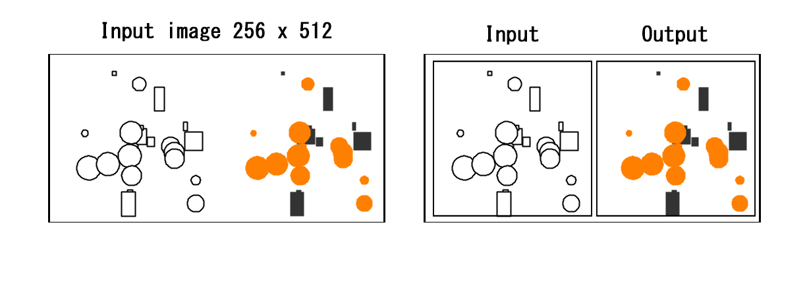

# pix2pix-tensorflow

Ismahelio´s implementation

Based on the article by Jason Brownlee [How to Develop a Pix2Pix GAN for Image-to-Image Translation](https://machinelearningmastery.com/how-to-develop-a-pix2pix-gan-for-image-to-image-translation/)

Based on [pix2pix](https://phillipi.github.io/pix2pix/) by Isola et al.

[Article about this implemention](https://affinelayer.com/pix2pix/)

[Interactive Demo](https://affinelayer.com/pixsrv/)

Tensorflow implementation of pix2pix.  Learns a mapping from input images to output images, like these examples from the original paper:


I had to modify the scripts slightly to make them work appropriately with TensorFlow and Keras on Mac (at least on my Mac).


We need a folder that contains images with input-output next to each other, each one 256x256, so a 256x512 image, and another one with more images to verify the training works. Whit this sample, the model predicts from black and white shapes to orange circles and black rectangles.




## Setup

### Prerequisites
- Everything is in the requirements.txt


### Getting Started

```sh
# clone this repo
git clone https://github.com/ismahelio/pix2pix-tensorflow-isma.git
cd pix2pix-tensorflow

# I have left a little dataset in this repo as an example, only 20 variations. I encorage you to generate your own images to test the model

# Otherwise download the CMP Facades dataset (generated from http://cmp.felk.cvut.cz/~tylecr1/facade/ or http://efrosgans.eecs.berkeley.edu/pix2pix/datasets/maps.tar.gz)


# Create a virtual environment
python3 -m venv myenv

# Activate the virtual environment
source myenv/bin/activate

# Run requirements
pip install -r requirements.txt

# We need a folder that contains images with input-output next to each other, each one 256*256, so a 256*512 image and another one with more images to verify the trainning worked

# I have leave a very simple set inside the gh file for reference

# train the model (this may take ? hours depending on GPU, on CPU you will be waiting for a bit)

# First convert the images to a numpy array => .npz
python3 matrix.py 

# Second train the model using the npz file we just created
python3 pix2pix.py 

# Third, create another matrix - numpy array with the images to validate the model modifying the parameters in the matrix.py script
python3 matrix.py 

# Last run the model. Use the latest .h5 file generated while training => [X1, X2] = load_real_samples('maps_val.npz')

python3 testModel.py 


## Citation
If you use this code for your research, please cite the paper this code is based on: <a href="https://arxiv.org/pdf/1611.07004v1.pdf">Image-to-Image Translation Using Conditional Adversarial Networks</a>:

```
@article{pix2pix2016,
  title={Image-to-Image Translation with Conditional Adversarial Networks},
  author={Isola, Phillip and Zhu, Jun-Yan and Zhou, Tinghui and Efros, Alexei A},
  journal={arxiv},
  year={2016}
}
```

## Acknowledgments
This is a port of [pix2pix](https://github.com/phillipi/pix2pix) from Torch to Tensorflow.  It also contains colorspace conversion code ported from Torch.  Thanks to the Tensorflow team for making such a quality library!  And special thanks to Phillip Isola for answering my questions about the pix2pix code.
